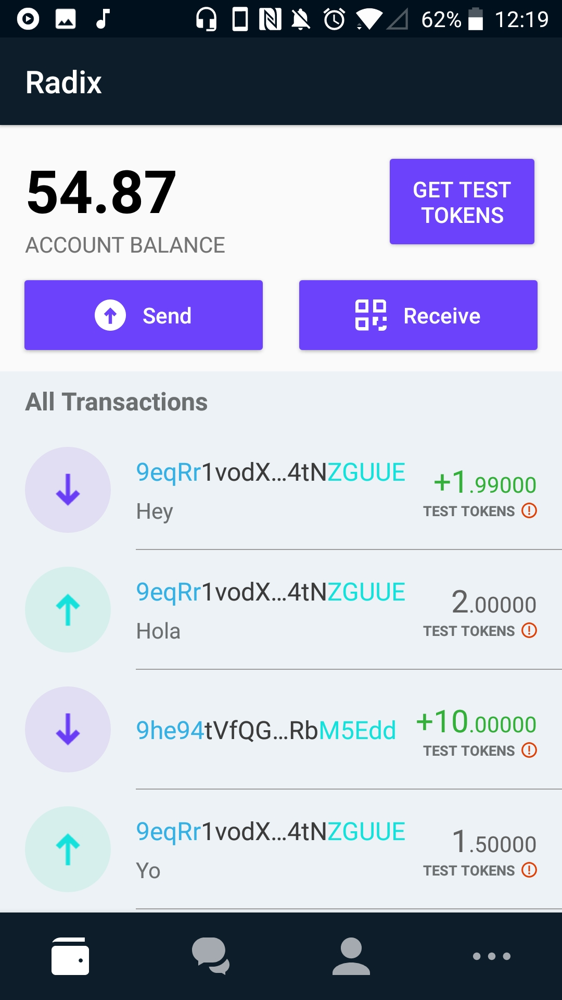
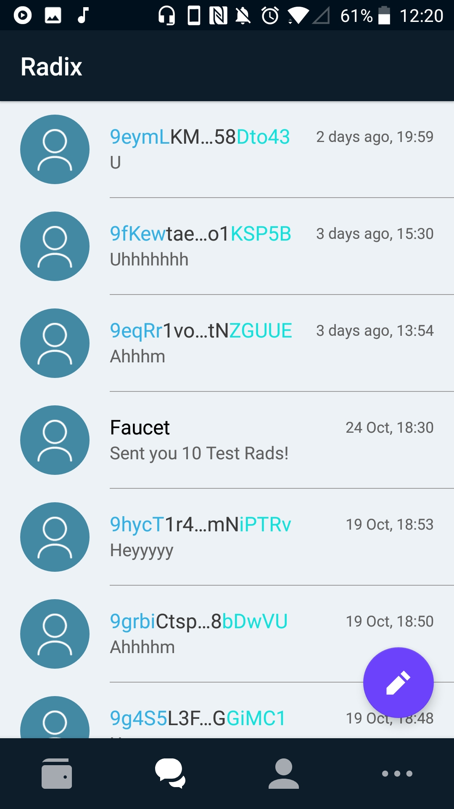

[](LICENSE)

# Note:

Master branch currently works with the old ALPHANET soon to be deprecated.  
Current recommended branch to work which works with BETANET hosted node is [release/1.0.0-beta](https://github.com/radixdlt/radixdlt-wallet-android/tree/release/1.0.0-beta)

# Radix DLT Android Wallet

The Radix DLT Android Wallet currently works with the live _ALPHANET_ universe and interacts with it
by making full use of the latest release of the [radixdlt-kotlin](https://github.com/radixdlt/radixdlt-kotlin) library.

The App is a work in progress and will soon be migrated to use the new version of our network.

&nbsp;
&nbsp;


## Table of contents

- [Changelog](CHANGELOG.md)
- [Android development](#android-development)
- [Development setup](#development-setup)
- [Code style](#code-style)
- [Contribute](#contribute)
- [Links](#links)
- [License](#license)

## Android development

 * Mostly written in [Kotlin](https://kotlinlang.org/) (A few classes are in Java but will be converted to keep it 100% Kotlin)
 * Uses [Architecture Components](https://developer.android.com/topic/libraries/architecture/): Room, LiveData and Lifecycle-components
 * Uses [dagger-android](https://google.github.io/dagger/android.html) for dependency injection
 * Uses [RxJava](https://github.com/ReactiveX/RxJava) 2 (Included by default by the radixdlt libs)

## Development setup

Use Android Studio 3.2.1 (or newer) to be able to build the app.

The app is currently using the latest release of the [radixdlt-kotlin](https://github.com/radixdlt/radixdlt-kotlin) library. It is 
possible to replace it with the [radixdlt-java](https://github.com/radixdlt/radixdlt-java) library but you will need to target newer
android devices >= API 24. Also, a few simple changes in the code are required and the dependency
to [rxkotlin](https://github.com/ReactiveX/RxKotlin) must be included in your gradle file.

```
implementation(group: 'io.reactivex.rxjava2', name: 'rxkotlin', version: '2.2.0') {
    exclude group: 'io.reactivex.rxjava2', module: 'rxjava'
    exclude group: 'org.jetbrains.kotlin', module: 'kotlin-stdlib'
}
```

## Code style

This project uses [ktlint](https://github.com/shyiko/ktlint) via [Gradle](https://gradle.org/) dependency.
To check code style - `gradle ktlint` (it's also bound to `gradle check`).

## Contribute

Contributions are welcome, we simply ask to:

* Fork the codebase
* Make changes
* Submit a pull request for review

When contributing to this repository, we recommend discussing with the development team the change you wish to make using a [GitHub issue](https://github.com/radixdlt/radixdlt-wallet-android/issues) before making changes.

Please follow our [Code of Conduct](CODE_OF_CONDUCT.md) in all your interactions with the project.

## Links

| Link | Description |
| :----- | :------ |
[radixdlt.com](https://radixdlt.com/) | Radix DLT Homepage
[documentation](https://docs.radixdlt.com/) | Radix Knowledge Base
[forum](https://forum.radixdlt.com/) | Radix Technical Forum
[@radixdlt](https://twitter.com/radixdlt) | Follow Radix DLT on Twitter

## Have a question?

If you need any information, please visit our [GitHub Issues](https://github.com/radixdlt/radixdlt-wallet-android/issues) or the [Radix DLT android wallet #general channel](https://discord.gg/53G6eZU). Feel free to file an issue with as much information as possible about the problem.

## License

Radix DLT Android Wallet is released under the [MIT License](LICENSE).
